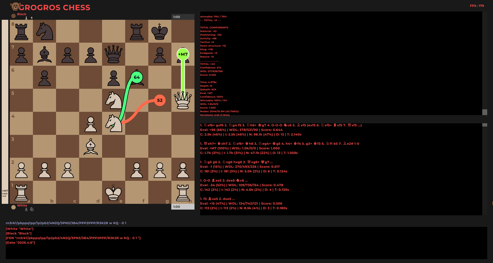
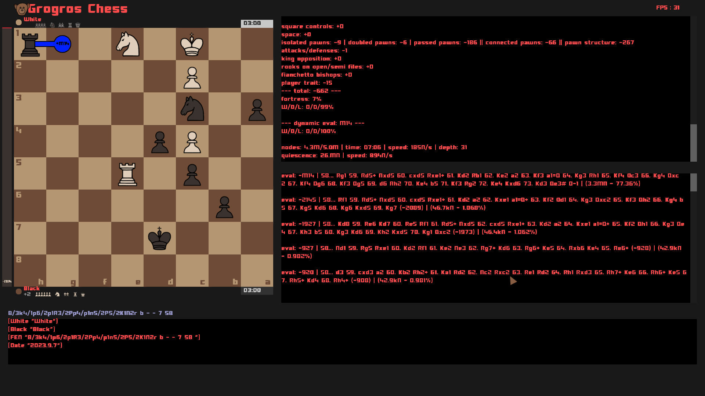
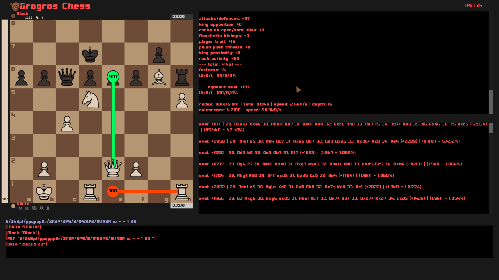
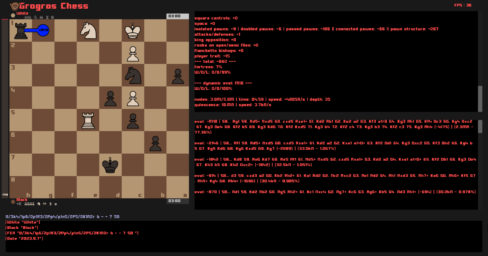

# OptiChess

[](LICENSE)
[](https://en.cppreference.com/w/cpp/20)
[](opti_chess/CMakeLists.txt)
[](opti_chess/CMakeLists.txt)



**OptiChess** is a research-oriented chess engine and analysis GUI written in modern C++20, built solo over several years (~23,000 lines). It is centred on **GrogrosZero**, a hybrid search that mixes UCT-style node selection with alpha-beta pruning, an integrated quiescence search, and WDL (win/draw/loss) statistical evaluation.

> **Note:** OptiChess is an experimental project focused on algorithmic research and performance work. It is not a UCI engine, and it is not intended for competitive play. See [Project status](#project-status) for the honest limits.

---

## What is actually interesting here

If you only read one section, read this one — these are the problems the project spends its time on:

- **Two score conventions, one codebase.** Public `Evaluation` values are *white-positive*; negamax, quiescence and the transposition table are *side-to-move*. Every boundary between the two is a conversion, and every missed conversion is a silent evaluation bug. The convention map is documented in [`ALGORITHMS.md`](opti_chess/ALGORITHMS.md).
- **Mate scores must be normalised by ply inside the TT.** A mate-in-N stored at one depth and read at another is wrong unless it is re-based on retrieval. This was a real bug, tracked and fixed — see [`BUGFIXES.md`](opti_chess/BUGFIXES.md).
- **Repetition state is path-local.** The same position reached by two different move orders does not share draw state during exploration, otherwise transpositions corrupt each other's threefold detection.
- **A bounded, zero-allocation search.** `Node` and `Board` objects are drawn from pools sized at startup from available physical memory. When a pool fills, the engine *refines* the existing tree instead of allocating — the process has a memory ceiling by construction.
- **A/B toggles at runtime.** Two experimental search paths (TT in the main search, and a transposition **DAG** instead of a tree) can be switched on and off live with `I` and `O` while the engine runs, so both branches are compared on the same position without a rebuild.

---

## Engine architecture

| Component | Description |
|-----------|-------------|
| **GrogrosZero** | Hybrid search: UCT-style node selection + alpha-beta pruning + quiescence (`exploration.cpp`) |
| **Evaluation** | 31 weighted terms — material, mobility, king safety, weak squares, trapped pieces, pawn structure… (`Evaluator`, `evaluation.h`) |
| **Transposition table** | Zobrist-keyed, depth-aware, side-to-move scores (`zobrist.cpp`) |
| **Move generation** | Array-based board with bitboard-assisted attack detection (`board.cpp`, `generation.cpp`) |
| **Memory management** | Preallocated pools (`NodeBuffer`, `BoardBuffer`) — no heap allocation in the search hot path (`buffer.cpp`) |
| **GUI** | raylib analysis board: variations, evaluation graph, game tree (`gui.cpp`) |
| **Neural network** | Optional NN evaluation, experimental (`neural_network.cpp`) |

A deeper, implementation-level account lives in [`docs/ARCHITECTURE.md`](opti_chess/docs/ARCHITECTURE.md).

---

## Tech stack

| Technology | Purpose |
|------------|---------|
| **C++20** | Language standard (`cxx_std_20`) |
| **CMake 3.24+** | Build system, with presets for Debug/Release |
| **raylib 5.5** | GUI: board rendering, input, fonts, shaders, sound |
| **tsl::robin_map 1.3** | Hash maps for the transposition table and node children |

Dependencies are fetched and pinned by CMake `FetchContent` — nothing to install by hand, and no third-party source in the repository.

---

## Building and running

### Prerequisites

- Windows 10/11 x64
- Visual Studio 2022 with the **Desktop development with C++** workload
- CMake 3.24 or later, and Git (CMake uses it to fetch dependencies on the first configure)
- Network access on the first configure only

### Build

All build commands run from the `opti_chess/` subdirectory, which is where `CMakeLists.txt` and `CMakePresets.json` live:

```powershell
cd opti_chess

# Release
cmake --preset windows-release
cmake --build --preset windows-release
.\build\windows-release\Release\opti_chess.exe

# Debug
cmake --preset windows-debug
cmake --build --preset windows-debug
.\build\windows-debug\Debug\opti_chess.exe
```

The first build compiles raylib from source and takes several minutes. CMake copies `resources/` next to the executable after each build, so the binary runs directly from its output directory.

There is no command-line interface: the executable opens the analysis GUI.

---

## Controls

OptiChess is driven from the keyboard once the board is open. The most useful bindings:

| Key | Action |
|-----|--------|
| `G` | Start / stop GrogrosZero analysis on the current position |
| `P` | Play the move GrogrosZero recommends |
| `←` / `→` | Step backward / forward through the game tree |
| `F` | Flip the board |
| `V` | Load a FEN from the clipboard |
| `X` / `C` | Copy the current FEN / PGN to the clipboard |
| `E` | Print the full evaluation breakdown to the console |
| `Space` | Start / stop the clock |
| `Ctrl` + `↑` / `↓` | Toggle GrogrosZero as the white / black player |
| `Del` | Clear the transposition table and the DAG |
| `I` / `O` | A/B toggle: TT in the main search / transposition DAG |
| `H` | Toggle arrow drawing and the on-screen controls panel |
| `T` | Run the built-in test suite (see below) |
| `Z` | Print the Zobrist key of the current position |

---

## Testing

The test suite is **interactive**: build the Debug preset, launch the application, and press `T`. Results are printed to the console. Automated CTest coverage is a known gap, not a feature — see [Project status](#project-status).

The suite has three parts (`tests.cpp`):

**1. Perft** — move generation is validated against reference node counts:

| Position | Depth | Reference counts |
|----------|-------|------------------|
| Start position | 5 | 20 / 400 / 8,902 / 197,281 / 4,865,609 |
| Kiwipete (`r3k2r/p1ppqpb1/…`) | 5 | 48 / 2,039 / 97,862 / 4,085,603 |

**2. Evaluation** — five reference positions scored in `[0, 1]` against an expected evaluation *and* an expected win rate, each with a tolerance band rather than an exact match: initial position, a trapped bishop on a2, a king that only *looks* unsafe, a hole on d5, and a strategically lost position.

**3. Problems** — tactical and positional puzzles solved under a 3-second budget, scored on whether the engine finds the intended move.

Additional puzzles can be appended to `Tests.txt`, which the suite imports at runtime.

---

## Project structure

```
.
├── README.md
├── LICENSE
├── CONTRIBUTING.md
└── opti_chess/
    ├── CMakeLists.txt       # Build configuration (raylib, robin-map, resources)
    ├── CMakePresets.json    # Windows Debug/Release presets
    ├── main.cpp             # Entry point
    ├── main_gui.h           # Application loop, input handling, engine actions
    ├── board.cpp/h          # Board state, FEN, legality, bitboards
    ├── generation.cpp/h     # Move generation
    ├── exploration.cpp/h    # GrogrosZero search, quiescence, node tree/DAG
    ├── evaluation.cpp/h     # Evaluator and its 31 weighted terms
    ├── zobrist.cpp/h        # Zobrist keys and transposition table
    ├── buffer.cpp/h         # Node and Board memory pools
    ├── game_tree.cpp/h      # Played variations, independent of the search tree
    ├── gui.cpp/h            # raylib interface
    ├── neural_network.cpp/h # Optional NN evaluation (experimental)
    ├── match.cpp/h          # Engine-vs-engine match scaffolding
    ├── player.cpp/h         # Player configuration (algorithm, evaluator, rating)
    ├── tests.cpp/h          # Perft, evaluation and problem suites
    ├── windows_tests.cpp/h  # Win32 layer: physical memory probe, screen binding
    ├── ALGORITHMS.md        # Algorithm reference (FR)
    ├── BUGFIXES.md          # Bug ledger (FR)
    ├── docs/                # Architecture and development guides (EN)
    └── resources/           # Images, fonts, sounds, shaders, opening book
```

---

## Performance and memory model

Search speed is the main design constraint, and it drives most of the structural choices:

- **No heap allocation in the search hot path** — nodes and boards come from pools allocated once at startup.
- **No virtual dispatch** anywhere in search or evaluation (zero `virtual` in the codebase).
- **Compile-time constants** wherever the value allows it (~280 `constexpr` uses).
- **A memory ceiling by construction** — pool capacity is derived from available physical memory and capped; a full pool deepens the existing tree instead of growing.
- **Cache-conscious layout** for the structures touched on every node.

Published benchmark figures (NPS, depth-to-time) are a known gap: the current numbers are collected ad hoc during development and are not reproducible from the repository yet. Profiling before and after any change to `exploration.cpp`, `evaluation.cpp` or `board.cpp` is the working rule.

---

## Documentation

| File | Contents | Language |
|------|----------|----------|
| [`opti_chess/docs/ARCHITECTURE.md`](opti_chess/docs/ARCHITECTURE.md) | Components, data flow, invariants to preserve when changing the engine | EN |
| [`opti_chess/docs/DEVELOPMENT.md`](opti_chess/docs/DEVELOPMENT.md) | Build, run, validate, troubleshoot | EN |
| [`opti_chess/ALGORITHMS.md`](opti_chess/ALGORITHMS.md) | Implementation-level reference: sign conventions, mate encoding, `Node` invariants, GrogrosZero loop, quiescence, TT semantics | FR |
| [`opti_chess/BUGFIXES.md`](opti_chess/BUGFIXES.md) | Ledger of algorithmic bugs — symptom, root cause, fix — including the ones still open, ranked by severity | FR |
| [`CONTRIBUTING.md`](CONTRIBUTING.md) | Conventions and expectations for changes | EN |

---

## Screenshots



| Analysis board | Evaluation graph | Game tree view |
|---|---|---|
|  |  |  |

> Screenshots come from development builds; the interface changes between commits.

---

## Project status

Stated plainly, so nothing here is a surprise:

- **Windows only.** The CMake file carries Linux and macOS branches, but the Win32 integration layer (`windows_tests.*`, and console setup in `main_gui.h`) is not yet abstracted, so those targets do not compile today.
- **No UCI protocol**, therefore no rating on a public list and no play against other engines. The engine-vs-engine `Match`/`Player` layer is scaffolding, not a finished feature.
- **No CI and no CTest.** Validation is the interactive `T` suite plus manual GUI checks.
- **`board.cpp` is oversized** (~12,000 lines) and is the main structural debt; splitting it along the move-generation / state / evaluation-support seams is the next refactor.
- **Comments are being migrated from French to English.** The two files a reader will open first, `exploration.cpp` and `board.cpp`, are fully translated; the GUI and header files still carry French comments.
- **Known open engine bugs are tracked publicly** in [`BUGFIXES.md`](opti_chess/BUGFIXES.md) rather than left implicit.

---

## License

Released under the [MIT License](LICENSE).
