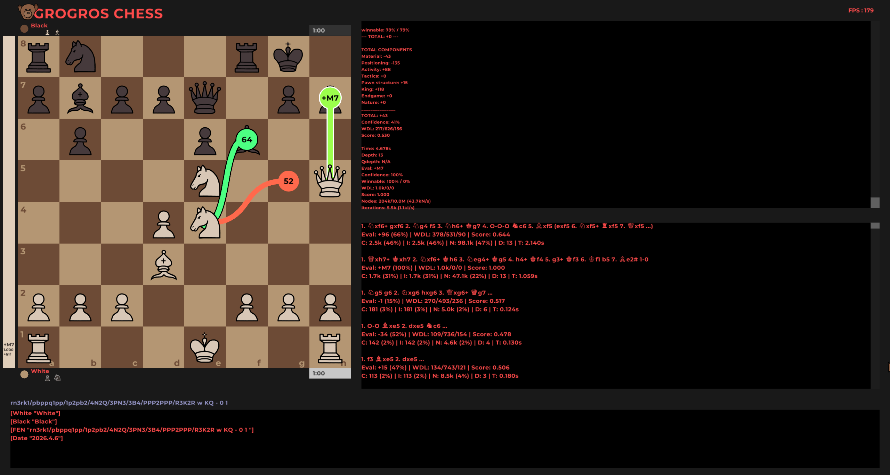

# OptiChess



OptiChess is an experimental C++ chess engine and research project implementing a hybrid search/exploration approach (GrogrosZero) with integrated quiescence search, position hashing (Zobrist), and an optional GUI built with raylib. The codebase mixes classical evaluation heuristics, WDL statistics and optional neural-network-driven evaluation with a Monte‑Carlo style exploration of the move tree.

This README collects: project overview, build and run instructions, architecture and data model, developer notes, known issues, and a roadmap / future plans.

---

## Table of contents
- Project overview
- Requirements
- Build
- Running
- Project structure and architecture
- Key algorithms and components
- Tests and benchmarks
- Contributing
- Known issues
- Roadmap / Future plans
- License

---

## Project overview

OptiChess is focused on researching move-exploration strategies that combine evaluation functions, quiescence search and a Monte‑Carlo like exploration algorithm named "GrogrosZero" in the code. The engine keeps a persistent buffer of boards and nodes to reduce allocation overhead, uses Zobrist hashing for repetition/draw detection and supports optional neural-network evaluation.

The project is research-oriented: code contains experiments, multiple pruning and exploration heuristics, and many TODO/FIXME notes. Use it as a base for experimentation and engine development rather than as a production-ready chess engine.

Key goals and scope:
- Create a flexible exploration framework that mixes directed expansion of promising moves and randomized/UCT-like exploration of already expanded branches.
- Reduce allocation overhead in deep exploration by using preallocated Board/Node buffers and compact Move representations.
- Provide hooks for neural-network evaluation while keeping a fast heuristic evaluator for low-latency play and debugging.

Non-goals (for now):
- Become a top-tier engine out of the box — the focus is research, not immediate competition ranking.
- Complete UCI support or polished GUI; these are planned but are secondary to the experimentation platform.

## Requirements

- Modern C++ compiler with C++17 or newer (g++, clang++, MSVC)
- CMake (recommended) or compatible build tool
- Third-party libraries used in the codebase:
  - tsl/robin_map (tsl::robin_map / robin_hash) — used for hash maps with lower memory overhead
  - raylib (optional) — GUI rendering and input
  - Any machine-learning library used by optional neural network component (if enabled)

If you don't have these libraries installed, the project may compile in a reduced configuration (without GUI/network support) depending on build flags and how the project is arranged.

## Build

Recommended (CMake):

1. mkdir build && cd build
2. cmake ..
3. make -j

If the project lacks a CMakeLists.txt you can compile with a compatible compiler manually. Example (minimal, for headless build):

```
g++ -std=c++17 -O2 -I./include -I/path/to/robin_map -c src/*.cpp
g++ -o optichess *.o -L/path/to/libs -lraylib -lotherlibs
```

Adjust include/link paths to match local installation of third-party dependencies.

## Running

After building, the produced binary (name depends on build system) will typically accept either a GUI mode (if raylib support compiled) or a command-line/test mode. The project contains evaluation, quiescence, and node-exploration entry points used by the UI and test code.

Refer to the source code (main entry point) to discover available CLI flags and default behavior.

## Project structure and architecture

This section briefly describes key files and components found in the repository (non-exhaustive):

- src/board.h / src/board.cpp — Board representation, move generation, evaluation helpers, Zobrist hashing and FEN utilities.
- src/exploration.h / src/exploration.cpp — Node and NodeBuffer types implementing the exploration tree, GrogrosZero driver, integrated quiescence search and Monte‑Carlo style exploration utilities.
- src/zobrist.* — Zobrist hashing utilities for board hashing and repetition detection.
- src/buffer.* — Buffer types used to allocate Board and Node objects in a large contiguous allocation to avoid frequent heap allocations.
- src/neural_network.* — Optional neural-network evaluation integration. Used when a Network object is provided to evaluation functions.
- src/useful_functions.* — Helper utilities (string formatting, time conversions, etc.).

Primary data types:
- Board — stores piece array, bitboards, legal moves, castling rights, zobrist key, game state and helper routines.
- Move — a compact struct using bitfields to describe a move with flags.
- Node — exploration tree node storing a pointer to a Board, children (robin_map<Move, Node*>), evaluations, visit/node counters and algorithmic state.
- NodeBuffer / BoardBuffer — large preallocated arrays used to avoid per-node/board heap allocations and accelerate experimentation.

Architecture notes (more detail):
- Memory layout: Board stores a 8x8 uint8_t array plus auxiliary bitboards and cached king positions; Move uses bitfields to minimize per-move memory.
- Pools: NodeBuffer and BoardBuffer are used to allocate contiguous arrays of nodes/boards to avoid frequent heap allocations in hot paths.
- Hashing: Zobrist hashing is used for quick repetition detection and optional transposition table keys.
- Evaluation: a heuristic evaluator produces _value, _uncertainty, _avg_score and WDL estimates; a Network* pointer may be passed for neural evaluation.

Design notes:
- The engine optimizes memory layout and uses stack/pooled buffers for Board/Node objects. This reduces allocation and deallocation overhead during deep exploration.
- Zobrist hashing is used for repetition detection and optional transposition table usage.
- Quiescence search is integrated with exploration: nodes evaluate static position, run quiescence and propagate values upward.

## Key algorithms and heuristics

- GrogrosZero: A Monte‑Carlo-like exploration algorithm implemented across Node::grogros_zero, Node::explore_new_move and Node::explore_random_child. It mixes targeted expansion of unexplored children with randomized exploration of already expanded children according to exploration scores.
- Integrated quiescence search: Node::quiescence performs capture/promotion/check-only searches with pruning (delta/standpat heuristics) and supports a minimal quiescence variant.
- Move scoring: Node::get_move_scores, get_node_score, and get_best_score_move compute exploration priorities using evaluation values, win/draw/lose estimates (WDL), and visit/iteration counts. Scores are exponentiated to emphasize better candidates and combined with exploration multipliers.

Practical constraints and tuning knobs:
- Alpha/beta parameters used inside get_node_score control how strongly evaluation gaps influence selection.
- Gamma controls exploration/exploitation balance in pick_random_child and can be adapted according to node uncertainty.
- Quiescence depth and delta/futility thresholds are tunable per-position to trade accuracy vs performance.

## Tests and benchmarks

The repository contains methods for node counting, move-generation benchmarks and position validation. Look for functions like Board::count_nodes_at_depth and related benchmarking utilities. To run or add unit tests, integrate a test framework (Catch2, GoogleTest, etc.) and add CI steps.

Suggested perft and regression tests to add immediately:
- perft positions: standard perft suite (depths 1..6) to validate move generation correctness.
- quiescence regression set: positions that previously exposed incorrect pruning or cutoff behavior.
- repetition/draw cases: positions that exercise zobrist/history handling.

## Contributing

Contributions are welcome. Typical workflows:

1. Fork the repository and create a topic branch.
2. Add tests for any behavioral changes or new features.
3. Keep changes minimal and focused; document design choices in code comments and README.
4. Open a pull request describing the change, motivation, and any performance implications.

Coding conventions and suggestions:
- Prefer RAII and standard containers (std::vector, std::unique_ptr) to manage lifetime.
- Avoid unnecessary dynamic allocations in hot code-paths; use NodeBuffer/BoardBuffer or other pools.
- Keep evaluation deterministic when possible to help debugging.

## Roadmap / Future plans

Planned and suggested work items (non-exhaustive):

- Stabilize and document build system (add CMakeLists.txt and platform CI for Linux / Windows / macOS).
- Add a suite of deterministic unit tests for move generation, perft (node counts) and evaluation correctness.
- Replace remaining raw `new`/`delete` usages with RAII (std::vector, std::unique_ptr) or clearly documented object pools.
- Implement a configurable transposition table (thread-safe) with entry replacement strategies.
- Improve quiescence pruning (SEE filtering, futility, standpat pruning) and add regression tests for edge-case mate lines.
- Provide a headless engine CLI with UCI support for interoperability and benchmarking against other engines.
- Add optional multi-threaded search support, ensuring buffer and transposition table safety.
- Integrate a small self-play training loop using the neural-network evaluation component and save/load model support.
- Add CI with static analysis and fuzz testing of move-generation.

More detailed near-term milestones (3 months):
1. Add perft test harness and fix any move-generation bugs found.
2. Replace remaining use of `new` for ephemeral objects with stack/local containers or std::unique_ptr where appropriate.
3. Add a minimal CMake build and a small headless example that runs GrogrosZero for N iterations and prints the best move.

Mid-term (6-12 months):
- Implement UCI glue and basic time controls so the engine can be easily benchmarked.
- Add a small transposition table and basic threaded search experiments.
- Integrate a neural-network training driver for self-play (experimental).

Long-term (12+ months):
- Continuous integration with automated perft and quiescence regression tests.
- Research papers / documentation summarizing lessons from hybrid exploration strategies.
- Possibly rewrite hot paths with bitboard-centric implementation for speed.

## Known issues and TODOs

- Many TODO/FIXME comments exist in the codebase — this is expected since the project is experimental.
- Memory handling: large buffers are used (NodeBuffer/BoardBuffer) — ensure buffer sizes are tuned for your environment.
- Threading and concurrency are experimental; if you add parallel search you must ensure Board/Node buffers and shared hash tables are thread-safe.
- Some pruning heuristics and quiescence reductions are tuned experimentally and may produce incorrect results in edge cases. See comments in exploration.cpp.

If you encounter static analysis warnings about raw `new` allocations, prefer stack objects or standard containers (std::vector, std::unique_ptr) or a preallocated pool. The codebase already uses NodeBuffer/BoardBuffer to avoid repetitive allocation; where a short-lived history map was dynamically allocated, prefer passing a reference or using a local container.

## License

This repository does not include an explicit license file. Before using or redistributing, add a LICENSE file (MIT, Apache-2.0 or another permissive license if you want broad use) and update headers accordingly.